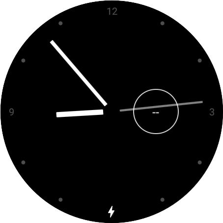
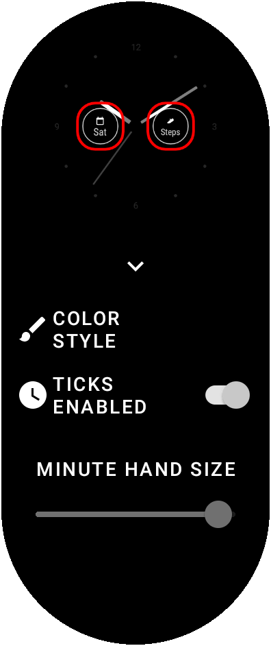
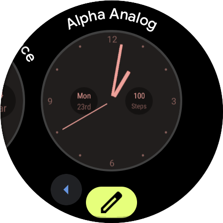
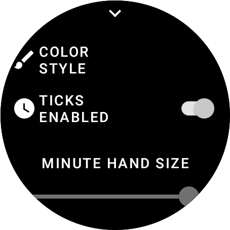

# MNU Lunch Menu watch face
## 개요
##### 늘 학교식당을 갈때마다 무슨 메뉴일지 모르고 가서 답답하였다. 식당에 가서도 주메뉴가 무엇인지 모르기 때문에, 뒤에 자장면이 나오는데 모르고 밥을 많이 담기도 해서 난감할때가 많았다. 스마트폰으로 대학 홈페이지에 들어가 볼 수도 있지만, 그렇게까지 점심 메뉴를 알아내기 위해 노력하고 싶지는 않았다. 이런 문제를 해결하기 위해 휴일 동안 스마트워치로 점심메뉴를 가져오는 기능을 구현했다. 미적 감각이 없어서 이쁘지 않아 다른 분들이 이쁘게 만들어 주면 좋겠다. :smile:
##### 안드로이드 watchface 샘플을 이용하여 목포대학교 홈페이지에서 점심 메뉴를 가져오는 코드입니다. 
## 주요기능
#### watchface는 코틀린 예제를 사용함
#### 홈페이지에 접속하여 매주 월요일 8시에 메뉴를 가져오는 코루틴 작성
#### 시간과 요일에 따라 watchface에 정보를 표현하는 함수 작성
#### 손목을 움직여 시간을 보면 menu가 추가적으로 보이게 함
#### sql을 사용하여 값을 저장. 
## 개발환경
### 요구사항
#### Android Studio
#### Kotlin
#### Android Wear OS SDK
#### Jsoup 라이브러리

### 설치 및 설정
#### Android Studio 설치: Android Studio 다운로드 페이지에서 Android Studio를 다운로드하고 설치합니다.
#### 프로젝트 생성: Android Studio에서 새로운 프로젝트를 생성합니다. Wear OS 템플릿을 선택합니다.
#### Kotlin 설정: 프로젝트의 build.gradle 파일에서 Kotlin을 설정합니다.
```
plugins {
    id 'com.android.application'
    id 'kotlin-android'
}
```
#### Jsoup 라이브러리 추가: build.gradle 파일에 Jsoup 라이브러리를 추가합니다.
```
dependencies {
    implementation 'org.jsoup:jsoup:1.14.3'
}

```
#### 프로젝트 구성: 위의 코드를 프로젝트에 추가하고 필요한 리소스와 레이아웃 파일을 구성합니다.
#### 에뮬레이터 설정: Android Wear OS 에뮬레이터를 설정하고 프로젝트를 실행하여 앱을 테스트합니다.
## 중요 함수 설명
### fetchweeklyLunchMenu
#### 이 함수는 국립목포대학교의 웹사이트에서 일주일간의 아침 및 점심 메뉴를 가져와서 반환합니다. 이를 위해 Jsoup 라이브러리를 사용하여 HTML 문서를 파싱하고, 각 날짜의 식단 정보를 추출합니다. 이 함수는 실패할 경우 1시간 후에 다시 시도합니다.
```
private suspend fun fetchWeeklyLunchMenu(): List<Pair<String, String>> {
    return withContext(Dispatchers.IO) {
        val formatter = DateTimeFormatter.ofPattern("MM.dd")
        val weeklyMenu = mutableListOf<Pair<String, String>>()

        for (i in 0 until 7) {
            val date = LocalDate.now().plusDays(i.toLong())
            val dateStr = date.format(formatter)

            try {
                Log.d(TAG, "Fetching lunch menu for date: $dateStr")

                val url = "https://www.mokpo.ac.kr/www/275/subview.do"
                val document: Document = Jsoup.connect(url).get()

                Log.d(TAG, "Fetched document")

                val dlElements = document.select("dl:has(span.date:contains($dateStr))")

                Log.d(TAG, "Found ${dlElements.size} dl elements for date: $dateStr")

                var breakfastMenu = "휴일"
                var lunchMenu = "휴일"

                for (dlElement in dlElements) {
                    val contWrapElements = dlElement.select("dd .contWrap")
                    Log.d(TAG, "Found ${contWrapElements.size} contWrap elements in a dl element")
                    if (contWrapElements.size > 0) {
                        val mainDish = contWrapElements[0].select("div.main").text()
                        val menu = contWrapElements[0].select("div.menu").text()
                        Log.d(TAG, "Found first menu for $dateStr: $mainDish, $menu")
                        breakfastMenu = "$dateStr:아침 $mainDish, $menu"
                    }
                    if (contWrapElements.size > 1) {
                        val mainDish = contWrapElements[1].select("div.main").text()
                        val menu = contWrapElements[1].select("div.menu").text()
                        Log.d(TAG, "Found second menu for $dateStr: $mainDish, $menu")
                        lunchMenu = "$dateStr:점심 $mainDish, $menu"
                    }
                }

                weeklyMenu.add(Pair(breakfastMenu, lunchMenu))
            } catch (e: Exception) {
                Log.e(TAG, "메뉴를 가져올 수 없습니다 for date: $dateStr. 1시간 후에 다시 시도합니다.", e)
                delay(3600000) // Delay for 1 hour
                return@withContext fetchWeeklyLunchMenu() // Retry fetching the weekly menu
            }
        }
        return@withContext weeklyMenu
    }
}
```
### scheduleMenuFetch
#### 이 함수는 매일 정해진 시간에 메뉴를 자동으로 업데이트하도록 예약합니다. 예약된 시간에 fetchWeeklyLunchMenu를 호출하여 메뉴를 업데이트합니다.
```
private fun scheduleMenuFetch() {
    scheduleDailyTaskAt(8)
}

private fun scheduleDailyTaskAt(hour: Int) {
    val calendar = Calendar.getInstance()
    calendar.set(Calendar.HOUR_OF_DAY, hour)
    calendar.set(Calendar.MINUTE, 0)
    calendar.set(Calendar.SECOND, 0)

    var initialDelay = calendar.timeInMillis - System.currentTimeMillis()
    if (initialDelay < 0) {
        calendar.add(Calendar.DAY_OF_YEAR, 1)
        initialDelay = calendar.timeInMillis - System.currentTimeMillis()
    }

    Executors.newSingleThreadScheduledExecutor().scheduleWithFixedDelay(
        {
            scope.launch {
                Log.d(TAG, "Fetching weekly menu at $hour:00")
                weeklyMenu = fetchWeeklyLunchMenu()
                Log.d(TAG, "Fetched weekly menu: $weeklyMenu")
                invalidate()
            }
        },
        initialDelay,
        TimeUnit.DAYS.toMillis(1),
        TimeUnit.MILLISECONDS
    )
}

```
### render 함수
#### 이 함수는 현재 시간을 기준으로 해당하는 날의 메뉴를 화면에 표시합니다. 사용자는 현재 시간에 따라 아침 메뉴와 점심 메뉴를 확인할 수 있습니다.
```
override fun render(
    canvas: Canvas,
    bounds: Rect,
    zonedDateTime: ZonedDateTime,
    sharedAssets: AnalogSharedAssets
) {
    val backgroundColor = if (renderParameters.drawMode == DrawMode.AMBIENT) {
        watchFaceColors.ambientBackgroundColor
    } else {
        watchFaceColors.activeBackgroundColor
    }

    canvas.drawColor(backgroundColor)

    drawComplications(canvas, zonedDateTime)

    if (renderParameters.watchFaceLayers.contains(WatchFaceLayer.COMPLICATIONS_OVERLAY)) {
        drawClockHands(canvas, bounds, zonedDateTime)
    }

    if (renderParameters.drawMode == DrawMode.INTERACTIVE &&
        renderParameters.watchFaceLayers.contains(WatchFaceLayer.BASE) &&
        watchFaceData.drawHourPips
    ) {
        drawNumberStyleOuterElement(
            canvas,
            bounds,
            watchFaceData.numberRadiusFraction,
            watchFaceData.numberStyleOuterCircleRadiusFraction,
            watchFaceColors.activeOuterElementColor,
            watchFaceData.numberStyleOuterCircleRadiusFraction,
            watchFaceData.gapBetweenOuterCircleAndBorderFraction
        )
    }

    drawMultilineText(canvas, "국립목포대학교 컴퓨터학부", textUniversity, bounds.width() * 0.4f, bounds.exactCenterX(), bounds.exactCenterY() - bounds.width() / 4 + 20)

    val currentDate = ZonedDateTime.now()
    val currentHour = currentDate.hour
    val dayOfWeek = currentDate.dayOfWeek.value - 1 // Convert to 0-based index
    val maxWidth = bounds.width() * 0.8f  // Adjust as necessary

    if (dayOfWeek in weeklyMenu.indices) {
        val (breakfastMenu, lunchMenu) = weeklyMenu[dayOfWeek]

        when (currentHour) {
            in 6..9 -> drawMultilineText(canvas, breakfastMenu, textLunchMenu, maxWidth, bounds.exactCenterX(), bounds.exactCenterY() + bounds.width() / 6)
            in 10..12 -> drawMultilineText(canvas, lunchMenu, textLunchMenu, maxWidth, bounds.exactCenterX(), bounds.exactCenterY() + bounds.width() / 6)
            else -> drawMultilineText(canvas, "오늘은 좋은 날.", textLunchMenu, maxWidth, bounds.exactCenterX(), bounds.exactCenterY() + bounds.width() / 6)
        }
    } else {
        drawMultilineText(canvas, "메뉴를 불러오는 중...", textLunchMenu, maxWidth, bounds.exactCenterX(), bounds.exactCenterY() + bounds.width() / 6)
    }
}

```

## 향후 계획
#### 컴플리케이션으로 작성하여야 함
#### 학과특성에 맞는 워치페이스 제작이 필요함

## 예시


WatchFace Sample (Kotlin)
===============================
Demonstrates watch faces using the androidX libraries (Kotlin). **The newer [Watch Face Format][1]
(WFF) is recommended in preference to using these libraries.**

Introduction
------------
The AndroidX watch face libraries allow you to develop a watch face service in Kotlin. However,
[WFF][1] is strongly recommended in preference to this approach.

Steps to build in Android Studio
--------------------------------
Because a watch face only contains a service, that is, there is no Activity, you first need to turn
off the launch setting that opens an Activity on your device.

To do that (and once the project is open) go to Run -> Edit Configurations. Select the **app**
module and the **General** tab. In the Launch Options, change **Launch:** to **Nothing**. This will
allow you to successfully install the watch face on the Wear device.

When installed, you will need to select the watch face in the watch face picker, i.e., the watch
face will not launch on its own like a regular app.

Screenshots
-------------






Getting Started
---------------

This sample uses the Gradle build system. To build this project, use the "gradlew build" command or
use "Import Project" in Android Studio.

Support
-------

- Stack Overflow: https://stackoverflow.com/questions/tagged/wear-os

If you've found an error in this sample, please file an issue:
https://github.com/android/wear-os-samples

Patches are encouraged, and may be submitted by forking this project and
submitting a pull request through GitHub. Please see CONTRIBUTING.md for more details.

[1]: https://developer.android.com/training/wearables/wff
